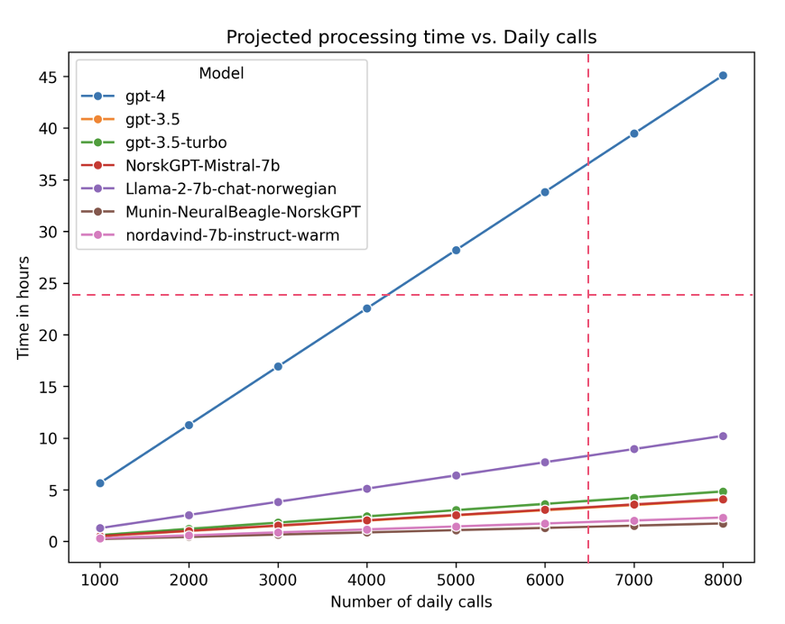
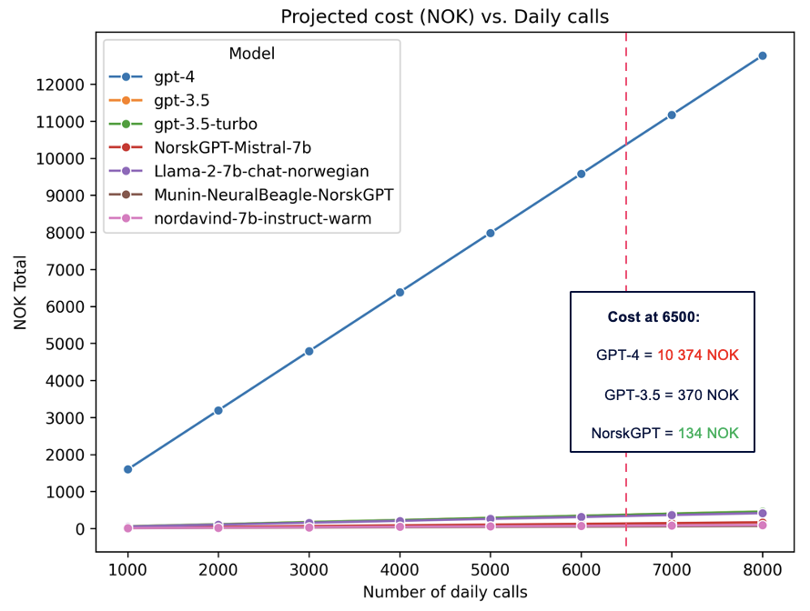
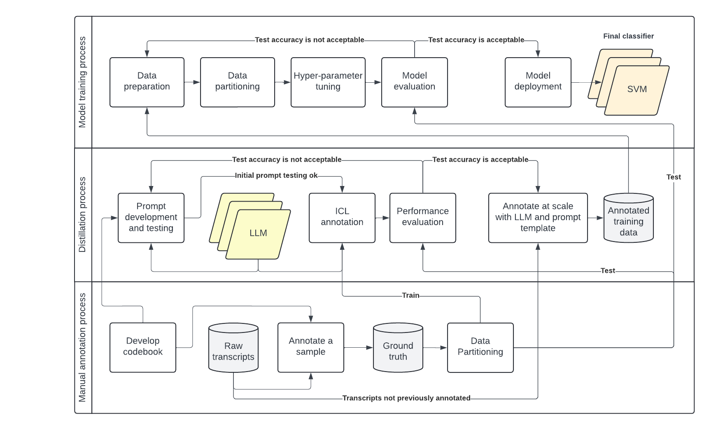

# Fannotate
 Faster annotation with Fannotate - this repo is the beginning of the framework and UI which will be used to annotate text training data _faster_ for weak supervision via LLMs.

# Fannotate Why?
 - **VOLUME, VELOCITY:** Currently, its not realistic or resposible to use LLMs in production for data stream text classification, as this can be solved in a faster and cheaper manner with targeted text classfiers trained on the distribution of the task at hand. 
- **ECONOMY OF SCALE:** Rather, using the LLM to generate training data (weak supervision) will result in cost savings both at inference time, as well as when annotating the training data.

Just because a LLM _can_ solve the task with minimal development costs, does not mean it is the best business decision to use a LLM in production. See the example below.

## Using LLMs in production for Telenor Norway Customer Service
This unit receives **6500** calls daily, on average (~4.3 million tokens, when using GPT2 tokenizer). The solution should therefore be able to process those calls within 24 hours to be useful. Tested using OpenAI models on Azure private cloud in March 2024, we got the following results when comparing to open source models available at the time:

The OpenAI models were subject to internal Telenor rate limits, i.e. that a request would get queued if too many users where querying at the time (to limit operating costs of launching another model instance). This has had a significant influence on the results, however, this also serves as a reminder that LLMs have limited capacity in terms of response times (larger model = slower response), especially when serving multiple users at the same time.

As seen by the diagram, this has an influence on the feasibility for text classification at scale.

## Daily costs of serving LLMs for text classification

When comparing the costs per token at the time (OpenAI vs. Amazon EC2 for hosting open source models), we found that the best performing model at the time (GPT4), which would match the accuracy of the current model in production (80%) would have unnacceptably high daily operating costs (given the Azure pricing model in April 2024), compared

# Fannotate How?
- This framework helps the analytics team create annotations of trainig data in a responsible manner, by:
    - Providing quantitative performance assessments before annotating at scale 
    - Enabling the user to switch models, review and/or change the validation data, adapt the annotation instructions over time, altogether aiming to improve the annotation process
- Which can then be used to train more efficient domain-level expert models

The full process will resemble the following pattern:

The documentation of the underlying HUGINN framework can be found here: [HUGINN documentation](HUGINN.md). The HUGINN codebase is provided in ``src/fannotate/`` at the time of writing (07/10/2024).
