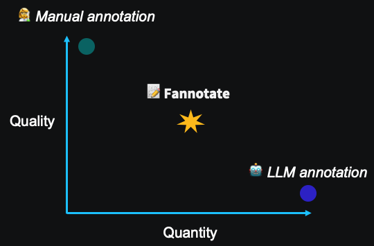

# Fannotate

Fannotate is a tool for *faster* text annotation aided by LLMs. Central to Fannotate is the *codebook* (annotation guidelines) which help the LLM do an initial guess at the categories and labels.

## Features

- Upload and manage annotation codebooks
- Auto-annotation using LLMs
- Manual review and correction interface
- Progress tracking and agreement analysis
- Support for both categorical and free-text annotations

With Fannotate, we try to find the right balance between quality and quantity by letting the LLM auto-fill a suggested annotation in addition to a summary of the full text, reducing the need to read through every piece of text to annotate.




## Installation & Usage

### Python Installation

1. Clone this repository:
   ```bash
   git clone https://github.com/tnresearch/fannotate.git
   cd fannotate
   ```

2. Create and activate a conda environment:
   ```bash
   conda create -n fannotate python=3.10
   conda activate fannotate
   ```

3. Install dependencies:
   ```bash
   pip install -r requirements.txt
   ```

4. Run Fannotate:
   ```bash
   python -m fannotate
   ```

5. Open your browser and navigate to http://localhost:1337


#### Using Docker

1. Build the Docker image:
   ```bash
   docker build -t fannotate .
   ```

2. Run the container:
   ```bash
   docker run -d -p 1337:1337 -v $(pwd)/uploads:/app/uploads fannotate
   ```

### Notes
- The application will be exposed on port 1337
- When using Docker, the `uploads` directory is automatically mounted and will keep data between container restarts
- All uploaded files will be stored in the `uploads` directory
- Fannotate will back up tables to the `uploads` directory
