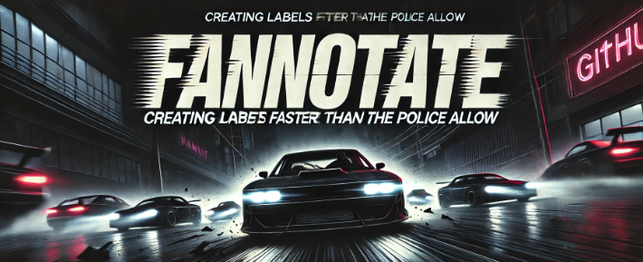

# Fannotate
 Faster annotation with Fannotate - this repo is the beginning of the framework and UI which will be used to annotate text training data _faster_ for weak supervision via LLMs.

# Why?
 - **VOLUME, VELOCITY:** Currently, its not realistic or resposible to use LLMs in production for data stream text classification, as this can be solved in a faster and cheaper manner with targeted text classfiers trained on the distribution of the task at hand. 
- **DISTILLATION** Rather, using the LLM to generate training data (weak supervision) will result in cost savings both at inference time, as well as when annotating the training data.

Just because a LLM _can_ solve the task, doesnt mean it is the best business decision to use a LLM for the particular task.

# How?
- This framework therefore help the ML team create annotations of trainig data in a responsible manner, by:
    - Providing initial quality assessments
    - Enabling the user to adapt the 'codebook' or description of each label over time

The full process will resemble the following pattern:

From here, the documentation of the HUGINN benchmark framework is preserved in order to make the dataption more smooth. 

The documentation of the underlying HUGINN framework can be found here: [HUGINN documentation](HUGINN.md). The HUGINN codebase is provided in ``src/fannotate/`` at the time of writing (07/10/2024).
